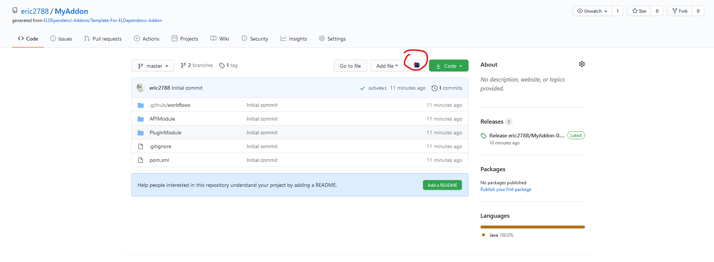

# 製作你的第一個擴充插件


在開始本教程前，請先確保你以完成以下步驟。

1. 已安裝 Maven 或 其他 依賴整合工具 (Build-automation utility)
2. 已安裝 git
3. 已安裝 Intellj IDEA 或 其他 擁有 VCS 操作的 整合開發環境 (IDE)



以下範例將使用如下環境

* Intellij IDEA 作為 整合開發環境
* Maven 作為 依賴整合工具


首先，進入 [擴充插件 範本 的 Github 頁面](https://github.com/ELDEpendenci-Addons/Template-For-ELDependenci-Addon)。&#x20;

其次，點擊 Use This Template 創建新 專案。


創建後將出現如下頁面


然後，用以下任一方式把你的專案 clone 到你的 IDE下。



欲要使用瀏覽器擴充下載源碼，請先下載[瀏覽器擴充](https://blog.jetbrains.com/blog/2020/04/07/toolbox-browser-extension-on-self-hosted-github-gitlab-bitbucket-instances/)。

然後，按下 你欲 使用的 IDE 按鈕 進行下載。






此處將以 https clone 作為範例。


首先，複製你的 git 連結。


然後，輸入如下的指令

```bash
# 連結為你所複製的 git 連結
git clone https://github.com/eric2788/MyAddon.git
```

打開你的 Intellij IDEA 並創建已存在源碼的專案。


最後定位你 git clone 的位置，並以 Maven 載入專案。




此處將以 https clone 作為範例。


首先，複製你的 git 連結。


然後，打開 Intellij IDEA 並以VCS 創建專案

.png>)

貼上你所複製的 git 連結

.png>)

完成後按 Clone 進行下載。



這樣，一個擴充插件的範本就被成功下載了。

.png>)


這是一個已經寫好的範本，因此你可以直接使用 `mvn package` 指令 或 到右側 maven 版面 按下 package 進行 建置，完成後打開 /target/ 就能找到成功建置的jar了。



